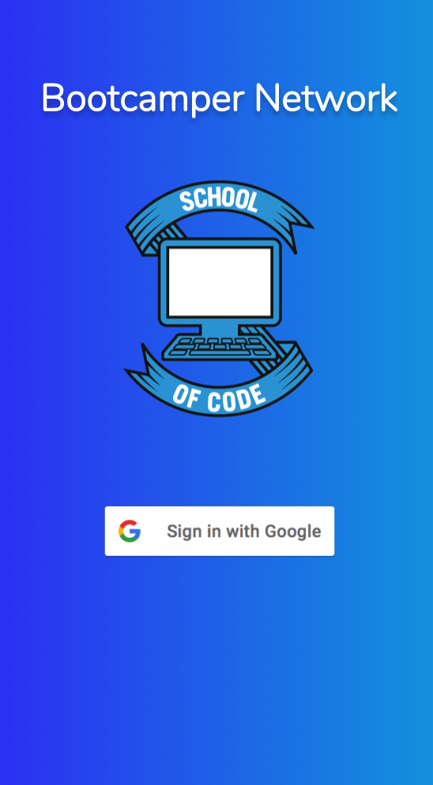
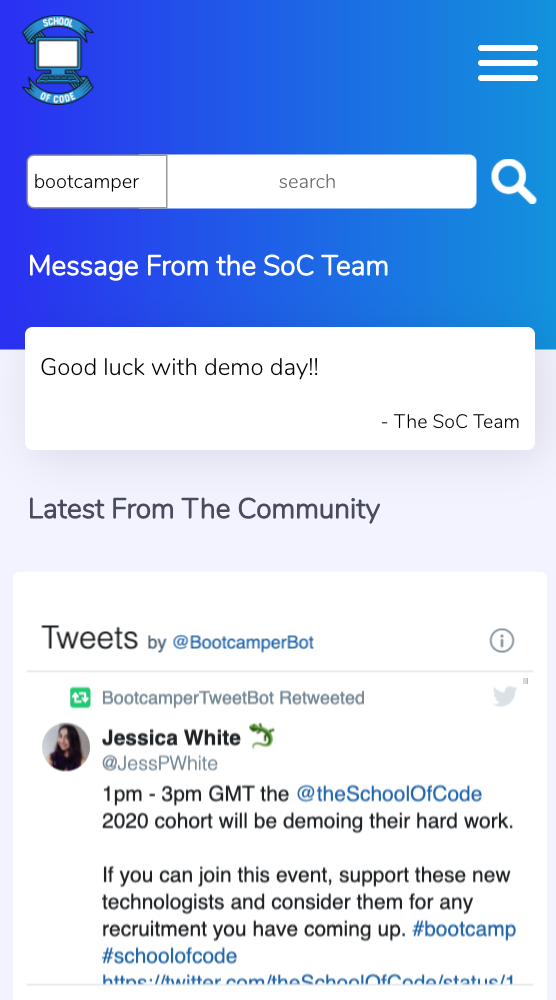
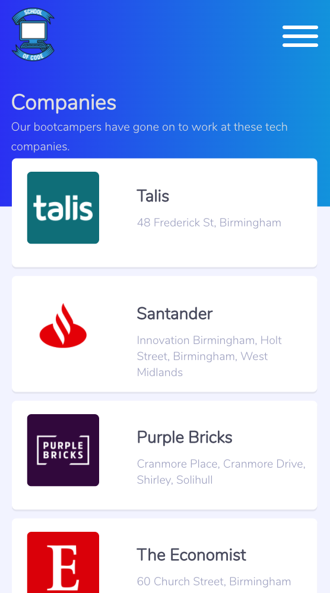

# School of Code Bootcamper Network App - Back End
## Final project for team Jomellen
### Jodie Neville, Mell Kay & Helen Kent

<table>
<td></td>
<td></td>
<td></td>
</table>

### Faced with the problem of a distributed network of current bootcampers and alumni, team Jomellen decided to bring everyone together with our Bootcamper Network App. School of Code bootcampers past and present can all now login to the app and share their career progress with each other. This enables other bootcampers to see all SoC affiliated companies easily. Bootcampers can also share (privately, with only the SoC team) their job satisfaction rating, allowing the team to reach out to support the bootcamper with a new job hunt. 

## **[Click here for the live site hosted on Netlify](https://bootcamper-network.netlify.app/)**

<table>
<td></td>
<td></td>
<td></td>
</table>

## How to use (only if you're from the School of Code!)
1) Click the link above and login with your Google account.
2) Create an account.
3) Investigate the app!

## Installation
1) Clone or download this repository and the front end repository (follow instructions for front end on front end readme)
2) cd into the project folder.
3) Run *npm install* to download dependencies
4) Create a database with the provider of your choice and add the env variables to a .env file
5) Add your meet up api email and password to the .env file for the OAuth2 process.
6) Run *npm run dbreset*, *npm run dbcreatemessagetable* and *npm run dbcreatedashboardtable* to set up your db and populate with dummy data.
7) Run *npm run dev* to run the server locally.